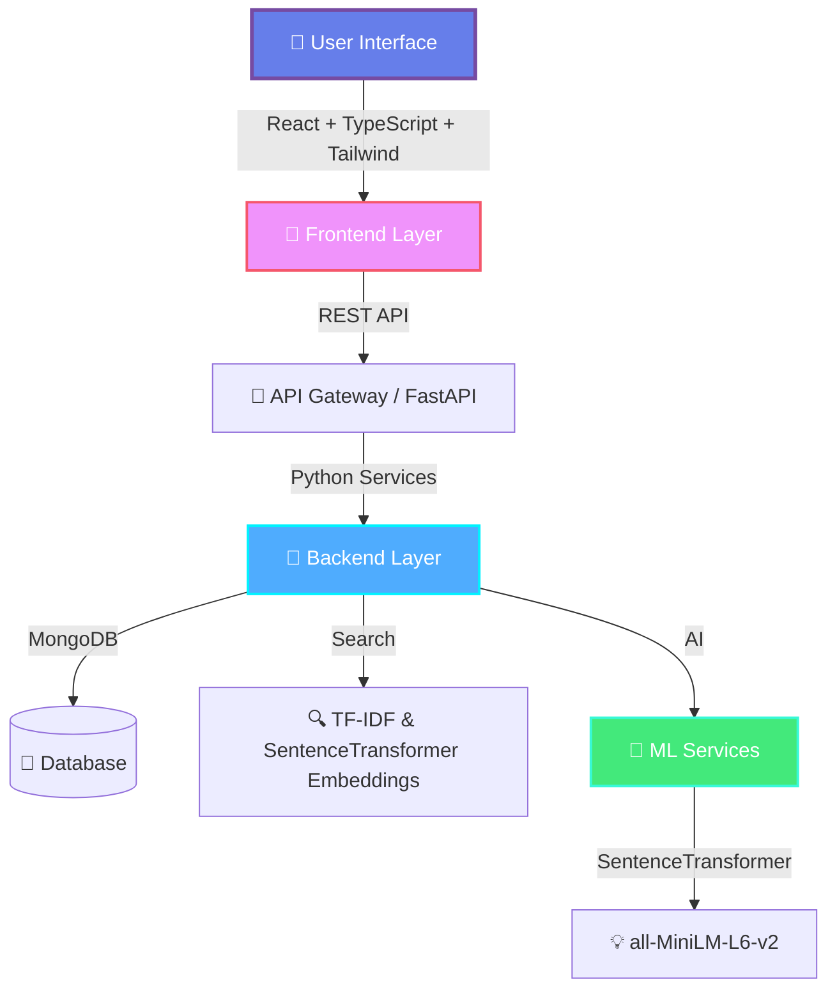
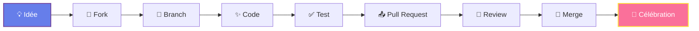
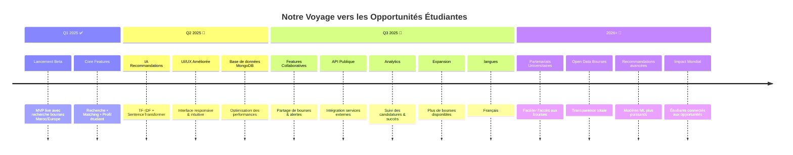

<div align="center">

<!-- Animated Header -->


<br/>

<!-- Typing SVG -->
<a href="https://git.io/typing-svg"></a>

<br/>

<!-- Badges avec style -->


<br/>

<!-- Social & Tech Stack -->
[](https://github.com/zakariaayl/ScholarHub)
[](https://github.com/zakariaayl)

</div>

---

<div align="center">

</div>

## 💫 Une Histoire qui Commence par un Rêve

"Dans un monde où les rêves coûtent cher, où l’accès au savoir semble parfois réservé à quelques privilégiés… nous avons voulu créer un chemin différent."

Il est 2h47 du matin.
À Marrakech, une étudiante cherche une bourse pour poursuivre ses études en ingénierie, mais se perd dans des sites contradictoires.
À Lyon, un jeune marocain veut décrocher un master en Europe, mais ne sait pas par où commencer.
À Agadir, un lycéen brillant n’ose même pas chercher - convaincu que les bourses ne sont “pas pour lui”.

Trois rêves. Trois destins suspendus.

C’est là que ScholarHub est né.
Pas d’une entreprise. Pas d’une stratégie marketing.
Mais d’un besoin viscéral : donner à chaque étudiant une vraie chance - simple, claire, humaine.

Parce qu’une bourse, parfois,
ce n’est pas juste de l’argent.
C’est une porte qui s’ouvre,
un avenir qui s’éclaire,
une vie qui bascule.

ScholarHub n’est pas un site.
C’est un pont.
Un mouvement silencieux pour briser les barrières, éclairer les chemins,
et dire à chaque étudiant :

“Ton rêve mérite une opportunité.
Nous t’aiderons à la trouver.”

---

<div align="center">

## 🎯 Pourquoi ScholarHub Existe Vraiment

<table>
<tr>
<td width="33%" align="center">

<h3>💔 Le Problème</h3>
<p><em>Les chercheurs travaillent en silos. Les découvertes restent invisibles. Les collaborations n'arrivent jamais.</em></p>
</td>
<td width="33%" align="center">

<h3>💡 Notre Vision</h3>
<p><em>Un monde où chaque idée trouve son équipe, où chaque talent brille, où la connaissance circule librement.</em></p>
</td>
<td width="33%" align="center">

<h3>🚀 La Solution</h3>
<p><em>Une plateforme intelligente, humaine, qui connecte, inspire et amplifie les voix qui comptent.</em></p>
</td>
</tr>
</table>

</div>

---


## ✨ Le Cœur de ScholarHub : Ce Qui Nous Rend Uniques

<div align="center">

```diff
+ 🎓 IA de Conseils Personnalisés pour les Bourses
  Une IA qui ne vous propose pas des bourses au hasard. Elle comprend vos ambitions.

+ 🌍 Passerelle Maroc–Europe
  Explorez les opportunités académiques des deux mondes, réunies en un seul endroit.

+ 🔎 Recherche Intelligente de Bourses
  Filtrez, explorez, découvrez : les financements qui correspondent vraiment à votre profil.

+ 🤝 Matching Étudiant–Bourse
  L’algorithme qui vous présente *la bourse qui vous attendait*.

+ 📊 Visibilité et Statistiques Transparentes
  Suivez les tendances, les taux d’acceptation, et trouvez votre voie stratégiquement.

+ 🧭 Guidance Académique Émotionnelle
  Une technologie qui ressent vos objectifs et vous guide comme un mentor.

+ 💼 Ressources pour Préparer Vos Dossiers
  CV, lettres de motivation, recommandations : maîtrisez tout avec clarté.

+ 🔒 Sécurité & Fiabilité Renforcées
  Chaque opportunité vérifiée, chaque information authentifiée.

```

</div>

---

<details open>
<summary><h2>🎨 Les 3 Piliers de Notre Écosystème</h2></summary>

<br/>

<table>
<tr>
<td width="33%">

### 🌟 **CONNECT**


**Trouvez votre tribu académique**

- Profils immersifs et authentiques
- Messagerie intelligente
- Groupes de recherche dynamiques
- Events virtuels et meetups
- Système de mentorat pair-à-pair

> *"Ce n'est pas LinkedIn. C'est un café intellectuel où les grandes idées se rencontrent."*

</td>
<td width="33%">

### 🔍 **DISCOVER**


**Explorez sans limites**

- Feed personnalisé par IA
- Recherche sémantique avancée
- Trending topics en temps réel
- Collections thématiques
- Alertes intelligentes

> *"Chaque scroll est une aventure. Chaque clic, une découverte."*

</td>
<td width="33%">

### 💡 **INNOVATE**


**Créez l'impossible**

- Collaboration en temps réel
- Outils de publication enrichis
- Peer review transparent
- Financement participatif
- Showcase de projets

> *"De l'idée à l'impact, nous sommes avec vous à chaque étape."*

</td>
</tr>
</table>

</details>

---

<div align="center">

</div>

## 🛠️ La Tech qui Donne Vie aux Rêves

<div align="center">

### **Frontend : L’Expérience Étudiante Réinventée**


> Une interface claire, réactive et intuitive pour que chaque étudiant trouve sa bourse facilement.

### **Backend : Le Cœur Qui Orchestrait les Opportunités**


> Backend solide et scalable pour relier étudiants & bourses en toute simplicité.

### **Intelligence & Recherche**


> Recherche intelligente et recommandations basées sur embeddings et TF-IDF pour trouver la bourse idéale.

</div>


---

## 🏗️ Architecture : La Symphonie Technique

<div align="center">



</div>
---
## 🧪 Évaluation du Système de Recherche

<div align="center">

**Notre moteur de recherche a été testé avec des requêtes réelles, et voici les résultats :**

| Requête | Précision | Rappel | F1-Score |
|---------|-----------|--------|----------|
| "intelligence artificielle France" | 100% | 100% | 1.0000 |
| "master data science Europe"       | 60%  | 100% | 0.7500 |
| "bourse doctorat"                  | 60%  | 100% | 0.7500 |
| "Allemagne ingénierie"             | 100% | 100% | 1.0000 |
| "États-Unis programme Fulbright"  | 20%  | 100% | 0.3333 |

**Moyennes globales :**

- **Précision moyenne :** 68%  
- **Rappel moyen :** 100%  
- **F1-Score moyen :** 0.7667  

> Le rapport complet est disponible dans `uploads/data/evaluation_report.json`

</div>

---

<div align="center">

</div>

## 🚀 Quick Start : Rejoignez l'Aventure en 3 Minutes

```bash
# 1️⃣ Clone le rêve
git clone https://github.com/zakariaayl/ScholarHub.git
cd ScholarHub

# 2️⃣ Installez la magie
npm install

# 3️⃣ Configurez votre environnement
cp .env.example .env
# Ajoutez vos clés API (OpenAI, Database, etc.)

# 4️⃣ Lancez les bases de données
docker-compose up -d

# 5️⃣ Initialisez l'univers
npm run db:migrate
npm run db:seed

# 6️⃣ Démarrez l'aventure
npm run dev

# 🎉 Ouvrez http://localhost:3000 et laissez-vous émerveiller
```

<div align="center">

**🌟 En quelques secondes, vous êtes dans le futur de l'académie. 🌟**

</div>

---

## 🎭 Les Humains Derrière le Code

<div align="center">

> *"Les meilleures technologies sont créées par des gens qui se soucient profondément des autres."*

<br/>

<table>
<tr>
<td align="center" width="25%">

<br/>
<strong>🎨 Designers</strong>
<br/>
<em>Qui donnent vie à l'émotion</em>
</td>
<td align="center" width="25%">

<br/>
<strong>💻 Développeurs</strong>
<br/>
<em>Qui transforment les rêves en code</em>
</td>
<td align="center" width="25%">

<br/>
<strong>🧠 Data Scientists</strong>
<br/>
<em>Qui donnent de l'intelligence à la machine</em>
</td>
<td align="center" width="25%">

<br/>
<strong>📚 Chercheurs</strong>
<br/>
<em>Qui guident notre vision</em>
</td>
</tr>
</table>

<br/>

**Nous sommes une équipe de dreamers, de builders, de believers.**

Chaque ligne de code porte notre passion. Chaque feature raconte notre vision.

</div>

---


## 🤝 Contribuer : Rejoignez le Mouvement

Chez ScholarHub, **chaque contribution compte**. Que vous soyez développeur, designer, rédacteur ou simplement quelqu'un avec une idée brillante - **nous vous voulons**.

<div align="center">

### 💝 Comment Contribuer

</div>



<details>
<summary><h3>📋 Guide de Contribution Détaillé</h3></summary>

<br/>

#### 1️⃣ **Trouvez Votre Place**

- 🐛 **Bug Fixes** : Résolvez des issues existantes
- ✨ **Features** : Proposez des fonctionnalités innovantes
- 📚 **Documentation** : Améliorez nos guides
- 🎨 **Design** : Rendez l'interface encore plus belle
- 🌍 **Traduction** : Rendez ScholarHub accessible au monde entier

#### 2️⃣ **Setup Your Environment**

```bash
# Fork le repo
# Clone votre fork
git clone https://github.com/YOUR_USERNAME/ScholarHub.git

# Créez une branche
git checkout -b feature/amazing-feature

# Faites votre magie
# ...

# Commit avec amour
git commit -m "✨ Add amazing feature that changes everything"

# Push vers votre fork
git push origin feature/amazing-feature
```

#### 3️⃣ **Standards de Code**

- ✅ Tests unitaires obligatoires
- 📝 Documentation claire et humaine
- 🎨 Respect des conventions de style
- 💬 Commits descriptifs et émotionnels

#### 4️⃣ **Review Process**

Chaque PR est revue avec **soin et respect**. Nous croyons en une communauté bienveillante où chaque feedback construit.

</details>

<div align="center">

### 🌟 Contributeurs Actuels

<a href="https://github.com/zakariaayl/ScholarHub/graphs/contributors">
  
</a>

**Merci à chaque âme qui rend ce projet vivant. 💙**

</div>

---

## 🗺️ Roadmap : Le Voyage Continue

<div align="center">


</div>

---


---

<div align="center">

</div>


---

## 📜 Licence & Mentions Légales

<div align="center">

**ScholarHub** est distribué sous licence **MIT**.

Cela signifie : **liberté, ouverture, partage**.

[](https://opensource.org/licenses/MIT)

<br/>

```
Copyright (c) 2024 ScholarHub Team

Permission is hereby granted, free of charge, to any person obtaining a copy
of this software and associated documentation files (the "Software"), to deal
in the Software without restriction, including without limitation the rights
to use, copy, modify, merge, publish, distribute, sublicense, and/or sell
copies of the Software...
```

</div>

---

<div align="center">


---

<div align="center">

## 🔮 Dernière Pensée

<br/>


<br/><br/>

### *« ScholarHub n'est pas juste une plateforme. »*

### *« C'est un pont entre les esprits. »*

### *« Un amplificateur de voix. »*

### *« Un catalyseur de changement. »*

<br/>

**Nous ne construisons pas juste du code.**

**Nous construisons le futur de la connaissance humaine.**

<br/>

---

### ⭐ Si vous croyez en cette vision...

**Donnez une étoile à ce projet**

**Partagez-le avec quelqu'un qui en a besoin**

**Rejoignez-nous dans cette aventure**

<br/>

[](https://star-history.com/#zakariaayl/ScholarHub&Date)

</div>

---

<div align="center">


<br/>

**Made with 💜 by humans who care**

**Powered by ☕ and late-night inspiration**

<br/>

[](https://forthebadge.com)
[](https://forthebadge.com)
[](https://forthebadge.com)

<br/>

© 2024 ScholarHub - **Where Knowledge Meets Community** ✨

</div>
