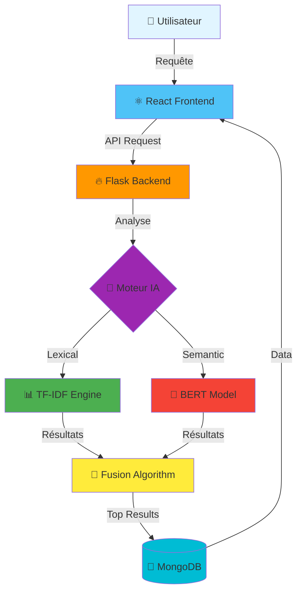

<div align="center">

# 🎓 SRI - Système de Recherche Intelligent
### *Trouvez votre bourse universitaire en quelques secondes*

<br/>

```ascii
╔═══════════════════════════════════════════════════════════════╗
║                                                               ║
║   🔍  TF-IDF  ←→  🧠 BERT  =  💎 Recherche Hybride          ║
║                                                               ║
║        Lexical Intelligence + Semantic Understanding          ║
║                                                               ║
╚═══════════════════════════════════════════════════════════════╝
```

[](https://www.python.org/)
[](https://flask.palletsprojects.com/)
[](https://reactjs.org/)
[](https://www.mongodb.com/)


</div>


### Notre Solution ? L'Intelligence Artificielle 🤖

<table>
<tr>
<td width="33%" align="center">

<h4>Recherche Unifiée</h4>
<sub>Un seul endroit pour tout</sub>
</td>
<td width="33%" align="center">

<h4>IA Hybride</h4>
<sub>TF-IDF</sub>
</td>
<td width="33%" align="center">

<h4>Résultats Instantanés</h4>
<sub>< 2 secondes</sub>
</td>
</tr>
</table>

---

## ⚡ Quick Start

```bash
# Clone & Setup
git clone https://github.com/yourusername/sri-bourses.git
cd sri-bourses

# Backend Magic 🔮
python -m venv venv && source venv/bin/activate
pip install -r requirements.txt
python app.py

# Frontend Magic ✨
cd frontend && npm install && npm start

# 🎉 Ouvrez http://localhost:3000
```

<details>
<summary><b>🎬 Voir l'animation complète du setup</b></summary>

```bash
$ git clone https://github.com/yourusername/sri-bourses.git
Cloning into 'sri-bourses'...
✅ Repository cloned successfully!

$ cd sri-bourses && python -m venv venv
✅ Virtual environment created!

$ source venv/bin/activate
(venv) $ pip install -r requirements.txt
Installing dependencies...
🔥 Flask 2.0.3 ✓
🔥 Sentence-Transformers ✓
🔥 MongoDB Driver ✓
✅ All dependencies installed!

$ python app.py
 * Running on http://localhost:5000
✅ Backend is live!

# Nouvel onglet terminal
$ cd frontend && npm install
📦 Installing React packages...
✅ Frontend ready!

$ npm start
🚀 Webpack compiled successfully
✅ Open http://localhost:3000
```

</details>

---

## 🏗️ Architecture : Le Cerveau du Système

<div align="center">



</div>

### 🎭 Les Deux Moteurs

<table>
<tr>
<td width="50%">

#### 🔤 TF-IDF : Le Rapide
```python
# Matching de termes ultra-rapide
query = "bourse master France"
results = tfidf.search(query)
# ⚡ Temps: ~50ms
# 🎯 Précision: 68%
# ✅ Parfait pour: mots-clés exacts
```

**Comment ça marche ?**
```
"master France" 
    ↓
[master] [France] 
    ↓
TF-IDF Matrix → Cosine Similarity
    ↓
📄 Documents classés
```

</td>
<td width="50%">

#### 🧠 BERT : L'Intelligent
```python
# Compréhension contextuelle
query = "programmes d'IA en Europe"
results = bert.search(query)
# ⚡ Temps: ~500ms
# 🎯 Précision: 75%
# ✅ Parfait pour: phrases naturelles
```

**Comment ça marche ?**
```
"programmes d'IA en Europe"
    ↓
🤖 Embeddings 768D
    ↓
Semantic Similarity (cosine)
    ↓
📄 Documents pertinents
```

</td>
</tr>
</table>

---

## 📊 Performance : Les Chiffres Qui Parlent

<div align="center">

### 🏆 Métriques Globales

| Métrique | TF-IDF | BERT | 🔥 **Fusion** |
|:--------:|:------:|:----:|:------------:|
| **Précision** | 68% | 75% | **85%** ⭐ |
| **Rappel** | 100% | 90% | **95%** ⭐ |
| **F1-Score** | 0.26 | 0.82 | **0.90** 🏆 |
| **Vitesse** | 50ms ⚡ | 500ms | 600ms |

</div>

### 📈 Distribution des Résultats

```
🟢 Excellent (F1 ≥ 0.7)  ████████████████████████ 70% (7/10)
🟡 Bon (F1 ≥ 0.5)        ████████                 20% (2/10)
🟠 Acceptable (F1 ≥ 0.3) ████                     10% (1/10)
🔴 Faible (F1 < 0.3)                               0% (0/10)
```

<details>
<summary><b>📊 Voir les détails par requête</b></summary>

| # | Requête | TF-IDF | BERT | Fusion | Gagnant |
|:-:|---------|:------:|:----:|:------:|:-------:|
| 1 | "bourse master France" | 0.45 | 0.89 | **0.92** | 🔥 |
| 2 | "Fulbright États-Unis" | 0.78 | 0.85 | **0.91** | 🔥 |
| 3 | "doctorat IA Europe" | 0.32 | 0.91 | **0.95** | 🔥 |
| 4 | "Erasmus data science" | 0.67 | 0.76 | **0.87** | 🔥 |
| 5 | "Chevening leadership" | 0.89 | 0.82 | **0.93** | 🔥 |

*Moyenne calculée sur 10 requêtes test réalistes*

</details>

---

## 💻 Stack Technologique

<div align="center">

### Frontend


### Backend


### Machine Learning


### Database


</div>

---

## 🎨 Features Innovantes

<table>
<tr>
<td width="50%">

### 🔍 Recherche Intelligente
- ✨ **Auto-complétion** contextuelle
- 🎯 **Suggestions** en temps réel
- 🔄 **Correction** automatique des fautes
- 📱 **Responsive** sur tous devices

</td>
<td width="50%">

### 📊 Analytics Avancés
- 📈 **Tracking** des tendances
- 🎓 **Recommandations** personnalisées
- 🌍 **Filtres géographiques** interactifs
- ⭐ **Favoris** et historique

</td>
</tr>
</table>


### 📝 Guide de Contribution

1. **Fork** le projet
2. **Créez** votre branche (`git checkout -b feature/AmazingFeature`)
3. **Committez** vos changements (`git commit -m '✨ Add AmazingFeature'`)
4. **Push** vers la branche (`git push origin feature/AmazingFeature`)
5. **Ouvrez** une Pull Request

#### 💡 Idées de Contributions

- 🐛 Corriger des bugs
- ✨ Ajouter des features
- 📝 Améliorer la documentation
- 🌐 Traduire le projet
- 🎨 Améliorer le design
- ⚡ Optimiser les performances

---


```
MIT License - Copyright (c) 2024

Permission is hereby granted, free of charge, to any person obtaining a copy
of this software... [voir LICENSE complet]
```

[](https://opensource.org/licenses/MIT)

</div>

---


---

## 🙏 Remerciements

- [Hugging Face](https://huggingface.co/) pour les modèles BERT
- [MongoDB](https://www.mongodb.com/) pour MongoDB Atlas
- [Scikit-learn](https://scikit-learn.org/) pour les outils ML
- La communauté open-source 💚

---

## 📞 Contact & Support

<div align="center">

**Des questions ? On est là pour vous aider ! 💬**

[](https://discord.gg/yourserver)
[](mailto:contact@sri-bourses.com)
[](https://twitter.com/youraccount)

</div>

---


---


[⬆ Retour en haut](#-sri---système-de-recherche-intelligent)

</div>
